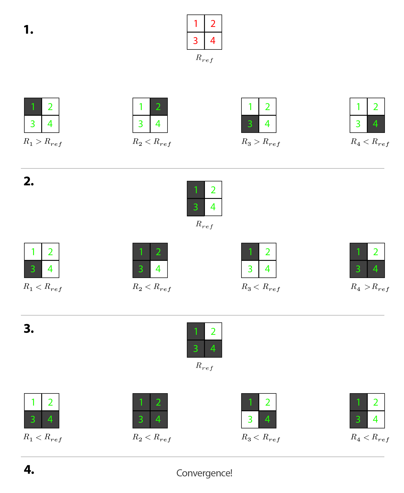

# RISPhaseShiftOptimizer

This is the souce code for <a href="#">Optimization of Quantized Phase Shifts for
Reconfigurable Smart Surfaces Assisted
Communications</a>

To run the optimizer, you need to clone this repository and after changing the workspace to the cloned repository directory, run <a href='https://github.com/moh-C/RISPhaseShiftOptimizer/blob/main/Driver.m'>Driver.m</a>.
In Driver.m, we generate a channel and then start to optimize the phase shifts to maximize the throughput. While generating the channel, <strong>dSR</strong>, distance of Source to to RIS, and <strong>dRD</strong>, distance of RIS to Destination can be chosen. Other parameters such as <strong>N</strong> or <strong>Subcarriers</strong> depend on your specific channel.

## Workspace

The optimizer was developed in MATLAB 2021a.

## Visual representation

In this algorithm, instead of having a greedy approach, we check "neighboring" configurations by flipping bits of the RSS. Upon improvement of rate, we flip the corresponding phases with reference to the primary phase of the current iteration and then, start the next iterations. A visual representation is provided for further clarification:

